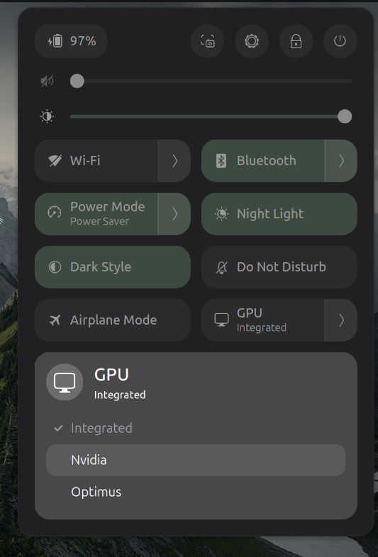

# Prime Control


Prime Control is a Gnome Shell Extension that uses the _prime-select_ in NVIDIA's proprietary drivers to switch between different GPU profiles in your Quick Menu. 

## Profiles

Prime Control allows you to switch between three different output profiles:

### Optimus (Default Profile)
Your computer will use Nvidia's Optimus feature, outputting most tasks with your integrated GPU by default but still powering your dedicated GPU and enabling you to dynamically execute some high performance tasks on it (e.g.: serving LLM inference, playing games).

While distributions like Ubuntu may be automatic, forcing the use of a dedicated GPU for some applications or services may require you to use `prime-run` command when starting a process.

In `prime-select query` the name of this mode is `on-demand`.

### Integrated
Your computer will use your integrated graphics and disable your dedicated graphics. This is ideal for strict battery conservation or for environments with low/minimal access to power (e.g.: running on airplane power ports), as it will likely significantly reduce your TDP and power consumption.

In `prime-select query` the name of this mode is `intel`.

### Dedicated
Your computer will use only your dedicated Nvidia GPU and disable your integrated graphics. Ideal for maximizing performance in gaming and AI operations, this will reduce latency by ensuring that you only will output GPU calls from your dGPU.

In `prime-select query` the name of this mode is `nvidia`.

*Note:* For some GPUs (e.g.: Ampere/RTX 30-series) you may be required to restart your system after selecting a new profile.

## Requirements 
- GNOME Shell 45+
- nvidia-prime (prime-select on PATH)
- pkexec (polkit)

## Manual Installation

Run **without sudo** from this repo:

```bash
git pull
./install.sh
```

If you previously installed an older build under `prime-selector@amanoske.github.com`, uninstall that first (or remove that directory) before enabling the new UUID.

The installer detects your `gnome-shell --version` and writes it into `metadata.json` so Extension Manager does not mark it incompatible.

GNOME does not pick up a newly copied extension until the Shell reloads. Do that next:

**X11**
1. Press `Alt+F2`, type `r`, press Enter
2. Then enable:

```bash
gnome-extensions enable prime-selector@amanoske.github.io
```

**Wayland**
1. Log out and log back in
2. Then enable:

```bash
gnome-extensions enable prime-selector@amanoske.github.io
```

Open the system menu (top-right) and look for the **GPU** tile in Quick Settings.

### What happens if I get the error "Incompatible with current GNOME version"?

Re-run `./install.sh` from an up-to-date checkout. It patches `shell-version` for your running Shell. Then reload/log out and enable again.

Check:

```bash
gnome-shell --version
cat ~/.local/share/gnome-shell/extensions/prime-selector@amanoske.github.io/metadata.json
```

### What happens if I get the error "Extension does not exist"?

That almost always means the Shell has not rescanned extensions yet. Reload/log out first, then run `enable` again.

Confirm the files landed in your user extensions directory (not root's):

```bash
ls ~/.local/share/gnome-shell/extensions/prime-selector@amanoske.github.io
gnome-extensions list | grep prime
gnome-shell --version
```

## Manual Uninstallation

Run **without sudo** from this repo:

```bash
./uninstall.sh
```

This disables the extension (when `gnome-extensions` is available) and removes:

```text
~/.local/share/gnome-shell/extensions/prime-selector@amanoske.github.io
```

Then reload GNOME Shell (Alt+F2 → `r` on X11, or log out on Wayland) so the GPU tile disappears.
